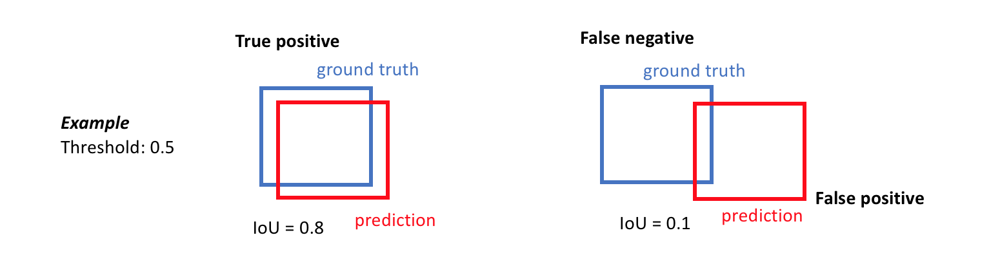
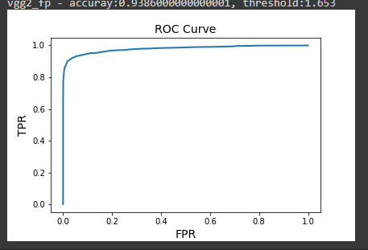

# **Face Detection Benchmark**
## **1. Metrics**
### **1.1 Precision-Recall (PR) Curve**
||||
|---|---|---|
|$_{GroudTruth}/Model$|1|0|
|1|TP|FP|
|0|FN|TN|

TP (True Positive) is an outcome where the model correctly predicts the positive class  
TN (True Negative) is an outcome where the model correctly predicts the negative class  
FP (False Positive)  is an outcome where the model incorrectly predicts the positive class  
FN (False negative) is an outcome where the model incorrectly predicts the negative class  

$Precision = \frac{TP}{TP + FP}$; $Recall = \frac{TP}{TP+FN}$

$F1 = 2*\frac{precision*recall}{precision+recall}$
   
### **1.2 mAP (mean Average Precision)**

$mAP = \frac{1}{n}\sum_{c \in classes}{Precision(c)}$ ~ $\frac{1}{n}\sum_{c \in classes}{\int_0^1Precision(c, k)dk}$

k: threshold 
n: number of classes
   

### **1.3 IoU (Intersection over Union)**

IoU = $\frac{AoO}{AoU}$

AoO: Area of overlap  
AoU: Area of Union

   

### **1.4 Receiver Operating Characteristic (ROC) curve**
- is a graph showing the performance of a classification model at all classification thresholds. This curve plots two parameters: 

$TPR = \frac{TP}{TP + FN}$, $FPR = \frac{FP}{FP + TN}$

TPR: True Positive Rate  
FPR: False Positive Rate

- An ROC curve plots TPR vs. FPR at different classification thresholds. Lowering the classification threshold classifies more items as positive, thus increasing both False Positives and True Positives. The following figure shows a typical ROC curve.
- The Area Under the Curve (AUC) is the measure of the ability of a classifier to distinguish between classes and is used as a summary of the ROC curve.
- example:

   

### **1.5 Inference Latency, light weight**
## **2. Datasets**
### **2.1. WIDER FACE**
- 32203 images, 393703 labels
- Train / Validate / Test ratio: 0.4 : 0.1 : 0.5  
- Image resolution: various
- annotation format: 
  - Path to image
  - list of bounding boxes
    - x1, y1, w, h, blur, expression, illumination, invalid, occlusion, pose
### **2.2. FDDB (benchmark dataset)**
- 2845 images, 5171 faces
- image resolution: various
- annotation format: 
  - Path to image
  - list of bounding boxes
    - x1, y1, w, h, blur, expression, illumination, invalid, occlusion, pose